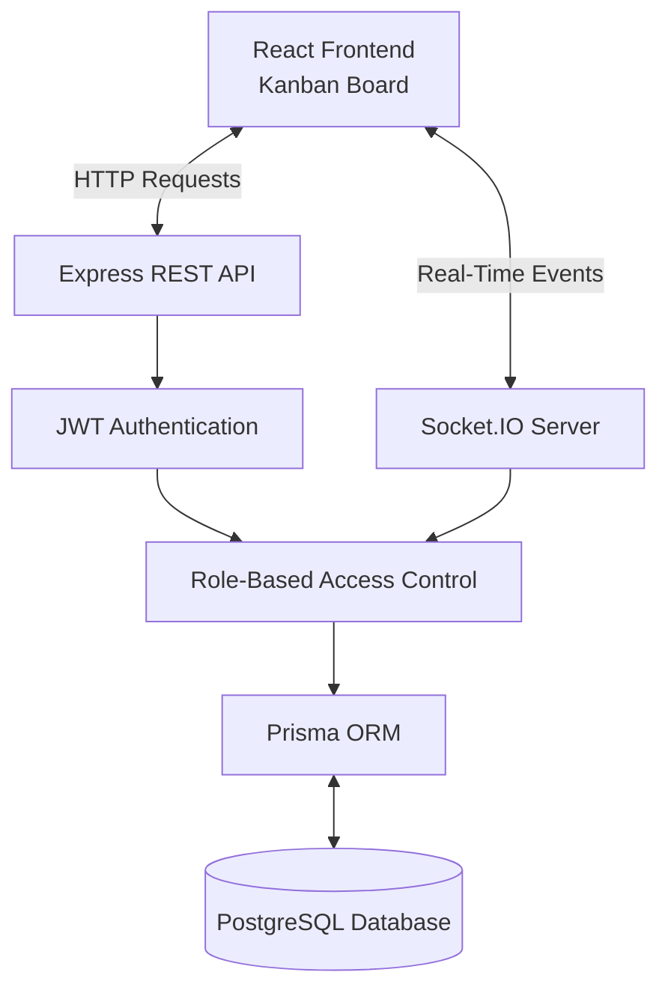

# System Architecture

```mermaid
flowchart TD
    A["React Frontend<br/>Kanban Board"]
    B["Express REST API"]
    C["Socket.IO Server"]
    D["JWT Authentication"]
    E["Role-Based Access Control"]
    F["Prisma ORM"]
    G[("PostgreSQL Database")]

    A <-->|HTTP Requests| B
    A <-->|Real-Time Events| C
    B --> D
    D --> E
    E --> F
    C --> E
    F <--> G
```
