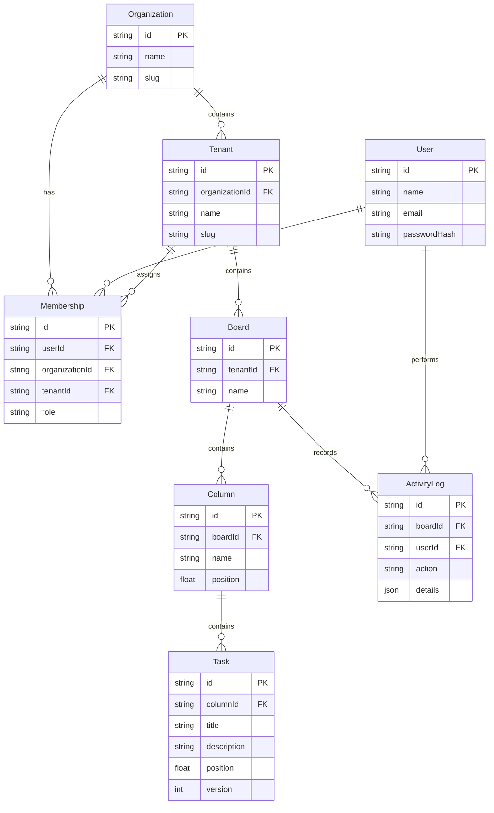

# Database Entity Relationship Diagram

```mermaid
erDiagram
    Organization ||--o{ Tenant : contains
    Organization ||--o{ Membership : has
    User ||--o{ Membership : belongs_to
    Tenant ||--o{ Membership : assigns
    Tenant ||--o{ Board : contains
    Board ||--o{ Column : contains
    Column ||--o{ Task : contains
    Board ||--o{ ActivityLog : records
    User ||--o{ ActivityLog : performs

    Organization {
        string id PK
        string name
        string slug
    }

    Tenant {
        string id PK
        string organizationId FK
        string name
        string slug
    }

    User {
        string id PK
        string name
        string email
        string passwordHash
    }

    Membership {
        string id PK
        string userId FK
        string organizationId FK
        string tenantId FK
        string role
    }

    Board {
        string id PK
        string tenantId FK
        string name
    }

    Column {
        string id PK
        string boardId FK
        string name
        float position
    }

    Task {
        string id PK
        string columnId FK
        string title
        string description
        float position
        int version
    }

    ActivityLog {
        string id PK
        string boardId FK
        string userId FK
        string action
        json details
    }
```
